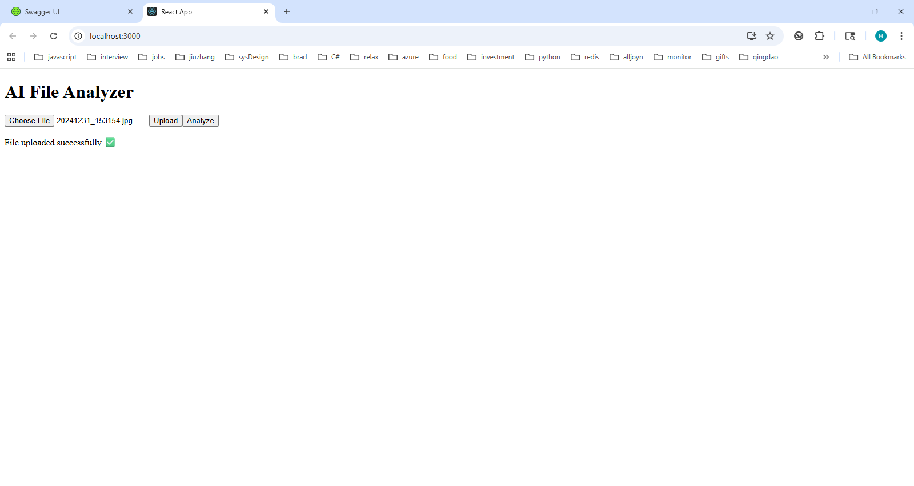
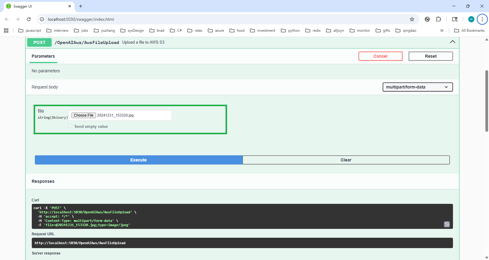
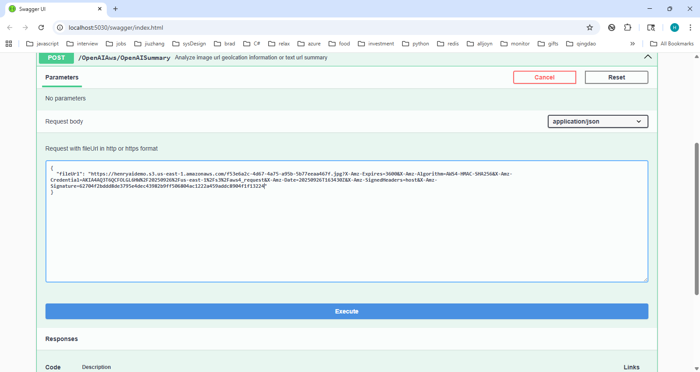

#  AWS File Analyzer
Imagine your desktop stored many old photos or text files, you forget where photos were taken, or what is the summary for text file. You want to upload these files to AWS S3, then use OpenAI api to analyze.

A full-stack project with .NET 8 API + React UI.  
Uploads local files to AWS S3, generate a presigned url and analyzes url with OpenAI API.

## 🚀 Demo Screenshots

### Upload UI



### API Response



## 🚀 Tech Stack
- Backend: .NET 8 Web API (C#)
- Frontend: React + Axios
- Cloud: AWS S3, OpenAI API

## 📦 How to Run Locally
### Backend
```bash
cd backend
update OpenAI:ApiKey in appsettings.development.json
update S3BucketName in OpenAwsController.cs
aws configure (for aws_access_key_id / aws_secret_access_key)
dotnet restore
dotnet run

### Frontend

cd frontend
npm install
npm start


## Future Plan 

Deploy backend service to AWS
Save analysis result to DynamoDB
More file type support (etc. PDF/audio/video)